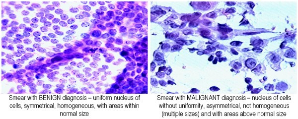

class: bg-main1
```{r setup, include=FALSE}
options(htmltools.dir.version = FALSE)
knitr::opts_chunk$set(echo = TRUE, eval= TRUE)
library(tidyverse)
library(dplyr)
library(ggplot2)
library(psych)
library(corrplot)
```
background-image: url("BreastCancer.jpg")
background-size: contain
---
class: bg-main1
##⚠️Breast cancer is the second leading cause of cancer death in women after lung cancer. 

--
##⚠️There is a 1 in 8 chance she will develop breast cancer in the United States.

--
##⚠️The average 5-year survival rate for women with invasive breast cancer is 90%.

--
###🔴If the cancer is located only in the breast, the 5-year survival rate of women with breast cancer is 99%. 62% of people with breast cancer are diagnosed with this stage.

--
###🔴If the cancer has spread to the regional lymph nodes, the 5-year survival rate is 85%.

--
###🔴If the cancer has spread to a distant part of the body, the 5-year survival rate is 27%.

---
class: split-two white

.column.bg-main1[.content[
## Breast Cancer Wisconsin (Diagnostic) Data Set 
###University of Wisconsin, Clinical Sciences Center
<br>
###⚪Attribute Information:
###Number of instances: 569
###Number of attributes: 32
<br>
###1) ID number 
###2) Diagnosis (M = malignant, B = benign) 
###3-32)Ten real-valued features are computed for each cell nucleus:
a) radius (mean of distances from center to points on the perimeter) 
b) texture (standard deviation of gray-scale values) 
c) perimeter 
d) area 
e) smoothness (local variation in radius lengths) 
f) compactness (perimeter^2 / area - 1.0) 
g) concavity (severity of concave portions of the contour) 
h) concave points (number of concave portions of the contour) 
i) symmetry 
j) fractal dimension ("coastline approximation" - 1)


]]
.column.bg-main2[.content[
###The mean, standard error and "worst" or largest (mean of the three largest values) of these features were computed for each image, resulting in 30 features. For instance, field 3 is Mean Radius, field 13 is Radius SE, field 23 is Worst Radius.


###⚪Class distribution: 357 benign, 212 malignant

]]


---
class: bg-main1
#Data Problems:
##.yellow[High dimensions]
###Attribute Information: Number of instances: 569, Number of attribute: 32
```{r, echo = FALSE, fig.align='center'}
Data <- read_csv("C:/Work/Project/STA7734/SVM-Asymptotic-Normality/Data/data.csv",
                 col_names = T,
                 col_types=cols(ID =col_character()，
                                Diagnosis=col_character(),
                                "3" = col_double(),
                                "4" = col_double(),
                                "5" = col_double(),
                                "6" = col_double(),
                                "7" = col_double(),
                                "8" = col_double(),
                                "9" = col_double(),
                                "10" = col_double(),
                                "11" = col_double(),
                                "12" = col_double(),
                                "13" = col_double(),
                                "14" = col_double(),
                                "15" = col_double(),
                                "16" = col_double(),
                                "17" = col_double(),
                                "18" = col_double(),
                                "19" = col_double(),
                                "20" = col_double(),
                                "21" = col_double(),
                                "22" = col_double(),
                                "23" = col_double(),
                                "24" = col_double(),
                                "25" = col_double(),
                                "26" = col_double(),
                                "27" = col_double(),
                                "28" = col_double(),
                                "29" = col_double(),
                                "30" = col_double(),
                                "31" = col_double(),
                                "32" = col_double()
                                )) %>%
                        rename( "radius" = "3",
                                "texture" = "4",
                                "perimeter" = "5",
                                "area" = "6",
                                "smoothness" = "7",
                                "compactness" = "8",
                                "concavity" = "9",
                                "concave_points" = "10",
                                "symmetry" = "11",
                                "fractal_dimension" = "12",
                                "radiusSE" = "13",
                                "textureSE" = "14",
                                "perimeterSE" = "15",
                                "areaSE" = "16",
                                "smoothnessSE" = "17",
                                "compactnessSE" = "18",
                                "concavitySE" = "19",
                                "concave_pointsSE" = "20",
                                "symmetrySE" = "21",
                                "fractal_dimensionSE" = "22",
                                "radiusW" = "23",
                                "textureW" = "24",
                                "perimeterW" = "25",
                                "areaW" = "26",
                                "smoothnessW" = "27",
                                "compactnessW" = "28",
                                "concavityW" = "29",
                                "concave_pointsW" = "30",
                                "symmetryW" = "31",
                                "fractal_dimensionW" = "32")
Data_drop <- Data[,-1] #drop ID
Data_drop %>%
  gather(key = "Var", value = "value", -Diagnosis) %>% 
  ggplot(aes(x=value, fill=Diagnosis)) + 
    geom_histogram(bins = 60) + 
    facet_wrap(~Var, scales = "free")
```

---
class: bg-main1
##.yellow[Multicolinearity]: Same feature for each image was computed in three ways - mean, standard error and "worst" or largest (mean of the three largest values), results in 30 variables.
### Correlaion analysis by spearman since most variables are non normal distributed
```{r, echo = FALSE, fig.align='center'}
#create correlation matrix
Cor <- Data_drop %>% 
       select(-Diagnosis) %>%
       cor(method="spearman")

corrplot(Cor, type="upper", order="hclust")
```

---
class: bg-main1

#Model: SVM
##.green[Article :] ["Asymptotic normality of support vector machine variants and other regularized kernel methods"](https://www.sciencedirect.com/science/article/pii/S0047259X11002090) --Robert Hable

--
##.yellow[SVM Estimator] $$S_n: (\mathcal{X} \, X \, \mathcal{Y})^n \to H, \quad D_n \mapsto f_{L,D_n,\lambda_{D_n}}$$

##where $f_{L,D_n,\lambda_{D_n}}$ is that function $f \in H$ which minimizes $$\frac{1}{n} \sum L(x_i,y_i,f(x_i)) + \lambda_{D_n}||f||_H^2$$.

---
class: bg-main1

##Investiagte the Asymptotic properties on estimators:

--
###.yellow[Assumptions] to prove that Empirical SVM $f_{L,D_n,\lambda_{D_n}}$ is converged to theoretical SVM $f_{L,P,\lambda_0}$. This is $$\sqrt{n}(f_{L,D_n,\lambda_{D_n}} - f_{L,P,\lambda_0})$$ converges weakly to a (zero-mean) Gaussian process in the function space H.:

--
###.yellow[1)] $\mathcal{X}$ bounded and closed, $\mathcal{Y} \in \{-1,1\}$ in Function space H, $f:\mathcal{X} \to \mathbb{R}$, $(X_1,Y_1),\dots,(X_n,Y_n)$ are independent and identically distributed according to some unknown probability measure P on $(\mathcal{X} X \mathcal{Y},\mathcal{B}(\mathcal{X} X \mathcal{Y}))$.

--
###.yellow[2)] Assume Loss function is two times continuously differentiable in the third argument. This assumption is not based on any unknown entity as such model distribution P.

--
###.yellow[3)] Assume L is a P-integrable Nemitski loss function. 


--
###.yellow[4)] $\lambda$ is random sequence, so it's possible to use any data-driven method for choosing the regulization parameter, such as cross-validation. It's desirable to have a bound $$0 \leq \mathcal{R}_{L,P}(f_{L,P,\lambda_0}) - \mathcal{R}_{L,P}^* \leq C(\lambda_0) \to 0 \text{for} \lambda \to 0$$ to find $\lambda$

---
class: bg-main1
##The Proof is done by below steps:

```{r, echo = FALSE, eval = FALSE, message= FALSE }
library(DiagrammeR)
m<- mermaid("
        graph LR
        A{Theorem 3.1} --> B{Theorem 3.2}
        subgraph Theorem 3.1
        C(Step1) --> D(Step2)
        D --> E(Step3)
        end
        A --- C(Step1) 
        ")
widgetframe::frameableWidget(m)
```

```{r, echo = FALSE, fig.align='center', out.height="100%" , out.width="100%"}
knitr::include_graphics("Diagram.png")
```


---
class: bg-main1
#.yellow[Theorem 3.1:]
```{r, echo = FALSE, out.width = "100%", out.height = "100%"}
knitr::include_graphics("Theorem31.png")
```

---
class: bg-main1
###.yellow[Step]1️⃣ Show that $\sqrt{n}(\mathbb{P}_{D_n} - P)$ converges weakly to a Gaussian process

--
###.yellow[Step]2️⃣The map $S: P \mapsto f_{L,P,\lambda}$ is suitably Hadamard-differentiable.

--
###🅰️ first order differentiable
###🅱️ second order differentiable

--
###.yellow[Step]3️⃣: Applying a functional delta-method, show asymptotic normality of $\lambda$,  $$\sqrt{n}(\lambda_{D_n} - \lambda_0) \xrightarrow{P} 0,$$ then the risk:    $$\sqrt{n}(\mathcal{R}_{L,P}(f_{L,D_n,\lambda_{D_n}}) - \mathcal{R}_{L,P}(f_{L,P,\lambda_0})) \to \sigma \mathcal{N}(0,1)$$

---
class: bg-main1
##Related theorems in our class:

--
###🍫**Lebesgue Dominated Convergence Theorem**：If the random variables $X_n \to X$, then we have $|X_n| \leq Y$, almost surely for all n. Then $X_n \in L^1$, $X \in L^1$, and $\lim_{0\to\infty}E(X_n) = E(X)$.
<br>

--
###🍫**Central Limit Theorem** for some nonprametric estimators still are asymptotically normal for the same rate $\sqrt{n}$ as many parametric estiamators. This article showed that also SVM based on smooth loss fuctions enjoy an asymptotic normality property for the rate of $\sqrt{n}$.
<br>

--
###🍫**Taylor's series ( $O_p$ - delta function)** which was proved by law of large number (LLN). The average converges in probability to its expectation. 
<br>

---
class: bg-main1

#.yellow[Step]1️⃣️: CLT
```{r, echo = FALSE, out.width = "100%", out.height = "100%"}
knitr::include_graphics("Mainresult_1.png")
```

---
class: bg-main1

#.yellow[Step]2️⃣: Define $B_s$ for Hadamard-differentiability
```{r, echo = FALSE, out.width = "100%", out.height = "100%"}
knitr::include_graphics("Mainresult_2.png")
```

---
class: bg-main1

#.yellow[Step]3️⃣: Prove $\lambda$ is asymptotically normal so delta method can be applied
```{r, echo = FALSE, out.width = "100%", out.height = "100%"}
knitr::include_graphics("Mainresult_3.png")
knitr::include_graphics("Mainresult_4.png")
```


---
class: bg-main1
#.yellow[Prove Theorem 3.1:] 
```{r, echo = FALSE, out.width = "100%", out.height = "100%"}
knitr::include_graphics("Theorem31_1.png")
knitr::include_graphics("Theorem31_2.png")
```

---
class: bg-main1

#.yellow[Final : Prove Theorem 3.2 based on Theorem 3.1]
```{r, echo = FALSE, out.width = "100%", out.height = "100%"}
knitr::include_graphics("Theorem32.png")
knitr::include_graphics("Theorem32_1.png")
```

---
class: bg-main1
#.yellow[Conclusion]:
##Asymptotic properties of support vector machines are investigated. 
<br>

--
###It is shown that the difference between the empirical and the theoretical SVM is asymptotically normal with rate $\sqrt{n}$; that is, $\sqrt{n}(f_{L,D_n,\lambda_{D_n}} - f_{L,P,\lambda_0})$ converges to a Gaussian process in the function space H.`r emo::ji("heavy_check_mark")`
<br>

--
###These results are not only of theoretical interest but also be a starting point for statistical inferences such as confidence intervals and hypothesis testing.`r emo::ji("heavy_check_mark")`
<br>

--
###Without any of such assumptions,similar results are not possible as follows from the no-free-lunch theorem.`r emo::ji("heavy_check_mark")`

---
class: middle center bg-main1

<br/>

#😇Thank you!

<br/>

####Slides created via the R package [**xaringan**](https://github.com/yihui/xaringan) with [ninja themes](https://github.com/emitanaka/ninja-theme).


