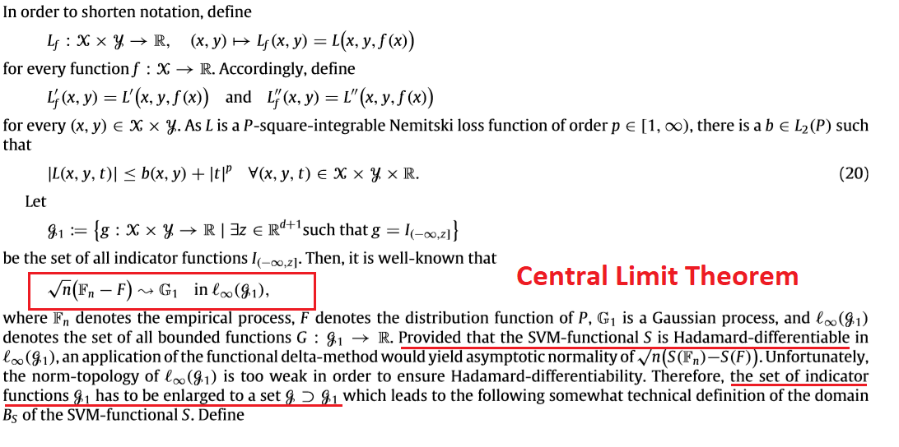
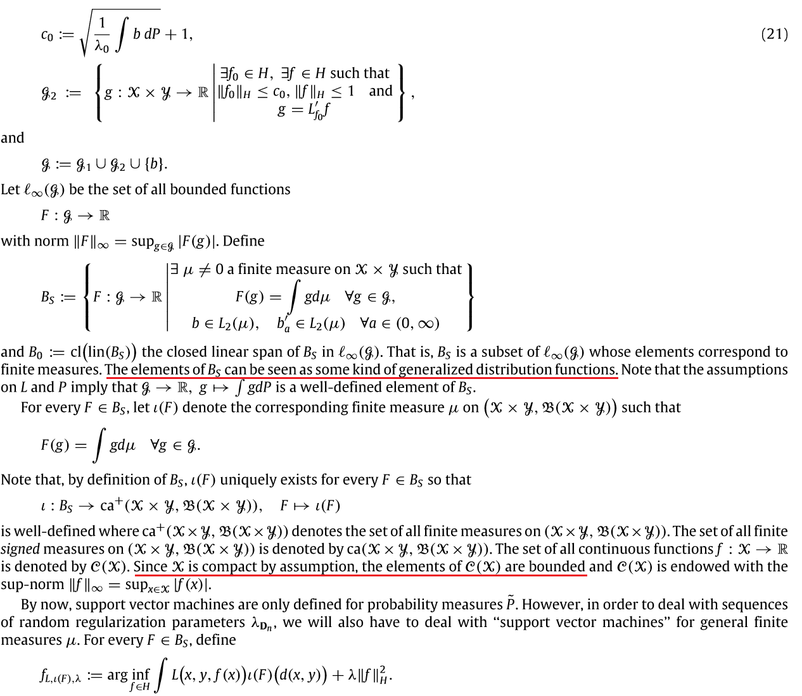
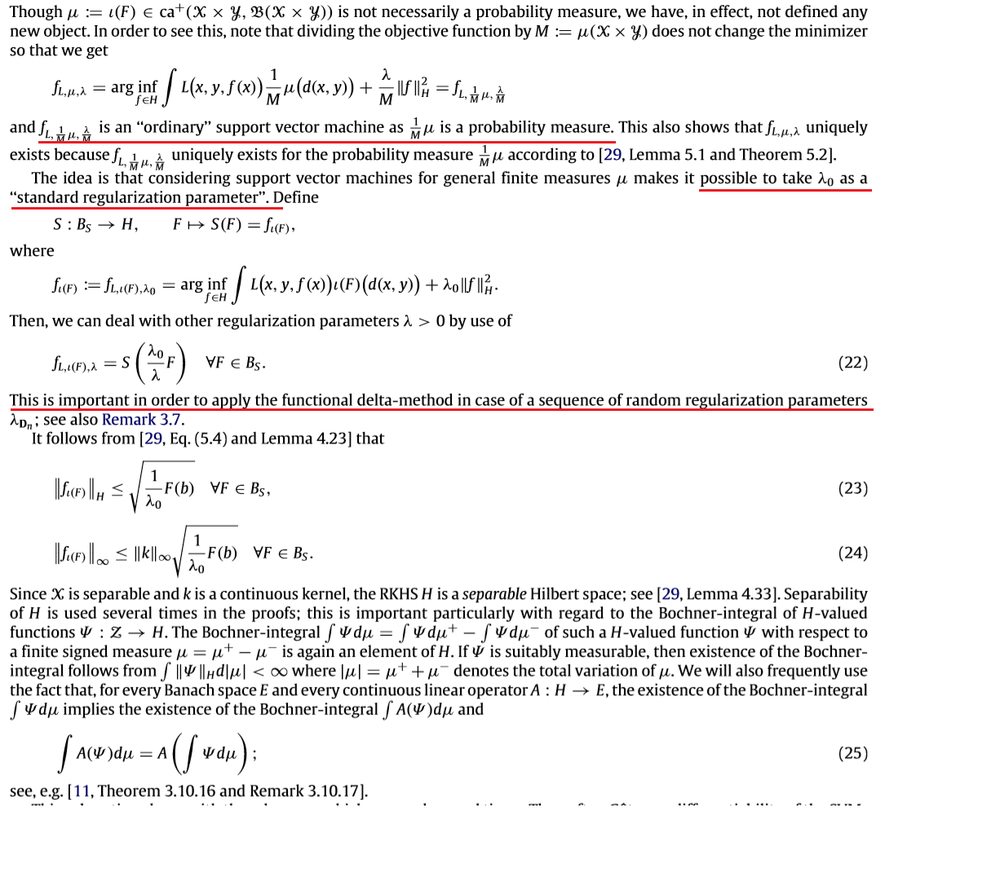
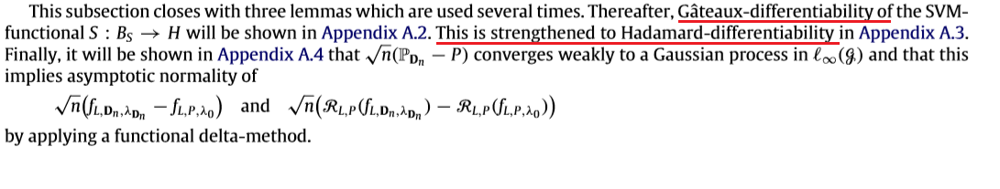

class: bg-main1 inverse black
```{r setup, include=FALSE}
options(htmltools.dir.version = FALSE)
knitr::opts_chunk$set(echo = TRUE, eval= TRUE)
library(tidyverse)
library(dplyr)
library(ggplot2)
library(psych)
library(corrplot)
```
background-image: url("BreastCancer.jpg")
background-size: contain

#Model: SVM
##.green[Article : "Asymptotic normality of support vector machine variants and other regularized kernel methods"  --Robert Hable ]

--
##.blue[SVM Estimator] $$S_n: (\mathcal{X} \, X \, \mathcal{Y})^n \to H, \quad D_n \mapsto f_{L,D_n,\lambda_{D_n}}$$

##where $f_{L,D_n,\lambda_{D_n}}$ is that function $f \in H$ which minimizes $$\frac{1}{n} \sum L(x_i,y_i,f(x_i)) + \lambda_{D_n}||f||_H^2$$.

---
class: bg-main1

##Investiagte the Asymptotic properties on estimators:

--
###.yellow[Assumptions] to prove that Empirical SVM $f_{L,D_n,\lambda_{D_n}}$ is converged to theoretical SVM $f_{L,P,\lambda_0}$. This is $$\sqrt{n}(f_{L,D_n,\lambda_{D_n}} - f_{L,P,\lambda_0})$$ converges weakly to a (zero-mean) Gaussian process in the function space H.:

--
###.yellow[1)] $\mathcal{X}$ bounded and closed, $\mathcal{Y} \in \{-1,1\}$ in Function space H, $f:\mathcal{X} \to \mathbb{R}$, $(X_1,Y_1),\dots,(X_n,Y_n)$ are independent and identically distributed according to some unknown probability measure P on $(\mathcal{X} X \mathcal{Y},\mathcal{B}(\mathcal{X} X \mathcal{Y}))$.

--
###.yellow[2)] Assume Loss function is two times continuously differentiable in the third argument. This assumption is not based on any unknown entity as such model distribution P.

--
###.yellow[3)] Assume L is a P-integrable Nemitski loss function. 


--
###.yellow[4)] $\lambda$ is random sequence, so it's possible to use any data-driven method for choosing the regulization parameter, such as cross-validation. It's desirable to have a bound $$0 \leq \mathcal{R}_{L,P}(f_{L,P,\lambda_0}) - \mathcal{R}_{L,P}^* \leq C(\lambda_0) \to 0 \text{for} \lambda \to 0$$ to find $\lambda$

---
class: bg-main1
##The Proof is done by below steps:

```{r, echo = FALSE, eval = FALSE, message= FALSE }
library(DiagrammeR)
m<- mermaid("
        graph LR
        A{Theorem 3.1} --> B{Theorem 3.2}
        subgraph Theorem 3.1
        C(Step1) --> D(Step2)
        D --> E(Step3)
        end
        A --- C(Step1) 
        ")
widgetframe::frameableWidget(m)
```

```{r, echo = FALSE, fig.align='center', out.height="100%" , out.width="100%"}
knitr::include_graphics("Diagram.png")
```


---
class: bg-main1
#.yellow[Theorem 3.1:]
```{r, echo = FALSE, out.width = "100%", out.height = "100%"}
knitr::include_graphics("Theorem31.png")
```

---
class: bg-main1
###.yellow[Step]1️⃣ Show that $\sqrt{n}(\mathbb{P}_{D_n} - P)$ converges weakly to a Gaussian process

--
###.yellow[Step]2️⃣The map $S: P \mapsto f_{L,P,\lambda}$ is suitably [Hadamard-differentiable](https://en.wikipedia.org/wiki/Hadamard_derivative):

--
###🅰️ S is Gateaux-differentiable(first and second order differentiable).
###🅱️ The Gateaux-derivative fulfills a continuity property.
###🆎 Above imply Hadamard-differentiability.

--
###.yellow[Step]3️⃣: Applying a functional delta-method, show asymptotic normality of $\lambda$,  $$\sqrt{n}(\lambda_{D_n} - \lambda_0) \xrightarrow{P} 0,$$ then the risk:    $$\sqrt{n}(\mathcal{R}_{L,P}(f_{L,D_n,\lambda_{D_n}}) - \mathcal{R}_{L,P}(f_{L,P,\lambda_0})) \to \sigma \mathcal{N}(0,1)$$

---
class: bg-main1

#.yellow[Step]1️⃣️: CLT
```{r, echo = FALSE, out.width = "100%", out.height = "100%"}

```

---
class: bg-main1

#.yellow[Step]2️⃣: Define $B_s$ for Hadamard-differentiability
```{r, echo = FALSE, out.width = "100%", out.height = "100%"}

```

---
class: bg-main1

#.yellow[Step]3️⃣: Prove $\lambda$ is asymptotically normal so delta method can be applied
```{r, echo = FALSE, out.width = "100%", out.height = "100%"}


```


---
class: bg-main1
#.yellow[Prove Theorem 3.1:] 
```{r, echo = FALSE, out.width = "100%", out.height = "100%"}
knitr::include_graphics("Theorem31_1.png")
knitr::include_graphics("Theorem31_2.png")
```

---
class: bg-main1

#.yellow[Final : Prove Theorem 3.2 based on Theorem 3.1]
```{r, echo = FALSE, out.width = "100%", out.height = "100%"}
knitr::include_graphics("Theorem32.png")
knitr::include_graphics("Theorem32_1.png")
```

---
class: bg-main1
#.yellow[Conclusion]:
##Asymptotic properties of support vector machines are investigated. 
<br>

--
###It is shown that the difference between the empirical and the theoretical SVM is asymptotically normal with rate $\sqrt{n}$; that is, $\sqrt{n}(f_{L,D_n,\lambda_{D_n}} - f_{L,P,\lambda_0})$ converges to a Gaussian process in the function space H.`r emo::ji("heavy_check_mark")`
<br>

--
###These results are not only of theoretical interest but also be a starting point for statistical inferences such as confidence intervals and hypothesis testing. `r emo::ji("heavy_check_mark")`
###"Inference for Support Vector Regression under $\mathcal{l_1}$ Regularization"
<br>

--
###Without any of such assumptions,similar results are not possible as follows from the no-free-lunch theorem.`r emo::ji("heavy_check_mark")`

---
class: middle center bg-main1

<br/>

#😇Thank you!

<br/>

####Slides created via the R package [**xaringan**](https://github.com/yihui/xaringan) with [ninja themes](https://github.com/emitanaka/ninja-theme).


